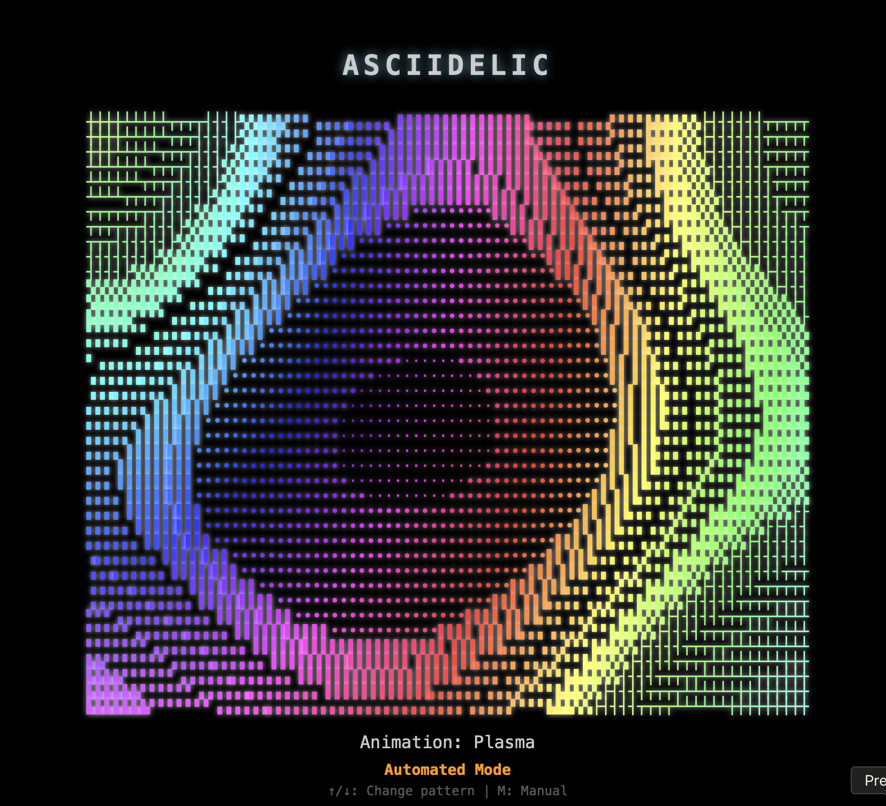

# AsciiDelic



AsciiDelic is an interactive ASCII art animation engine that renders colorful, dynamic visualizations using ASCII characters in your browser. Create mesmerizing patterns with various effects and styles for a unique retro-digital art experience.

**[Try it live: asciidelic.com](https://asciidelic.com)**

## 🌟 Features

- **10+ Animation Types**: Lava Lamp (default), Plasma, Nebula, Flow Field, Cellular, Cloud Formations, Spiral, Waves, Mandala, and multiple Tunnel variations
- **Interactive Controls**: Easily change patterns, colors, speed, and density
- **Dual-Mode Interface**: Switch between automated and manual parameter control
- **Randomize Function**: Instantly create new visual combinations
- **Multiple Color Modes**: Rainbow, monochrome, complementary, and gradient
- **Rich Character Sets**: Various ASCII characters create different visual textures
- **Responsive Design**: Adapts to different screen sizes
- **No Dependencies**: Pure JavaScript without external libraries

## 🚀 Getting Started

1. Clone the repository:
   ```bash
   git clone https://github.com/yourusername/asciidelic.git
   cd asciidelic
   ```

2. Open `index.html` in your web browser.

That's it! No build process or dependencies required.

## 🎮 Controls

| Key | Action |
|-----|--------|
| ↑/↓ | Previous/next animation pattern |
| ←/→ | Shift color hue (manual mode) |
| Space | Cycle through color modes (manual mode) |
| +/- | Increase/decrease animation speed (manual mode) |
| S/D | Decrease/increase character density (manual mode) |
| R | Randomize animation parameters |
| M | Toggle between automated and manual modes |

## 🧩 Project Structure

```
asciidelic/
├── src/
│   ├── animations/     # Animation effects
│   │   ├── plasma/     # Plasma-based animations
│   │   │   └── lavalamp/  # Lava lamp components
│   │   └── tunnels/    # Tunnel-based animations
│   ├── config/         # Default configurations 
│   ├── core/           # Engine components
│   │   └── automation/ # Automated parameter management
│   ├── ui/             # User interface components
│   │   ├── inputManager.js  # Keyboard and touch input handling
│   │   └── uiManager.js     # UI display management
│   └── utils/          # Helper functions
│       ├── color.js    # Color manipulation utilities
│       └── math.js     # Math helper functions
├── index.html          # Main entry point
└── styles.css          # Basic styling
```

## 🛠️ Creating Your Own Animations

New animations can be added by following these steps:

1. Create a new file in the `src/animations/` directory
2. Implement your animation function that takes `grid`, `time`, and `config` parameters
3. Register your animation in `src/animations/index.js`